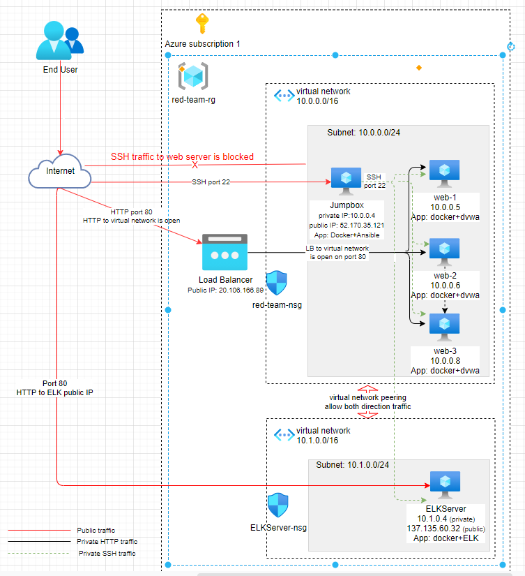
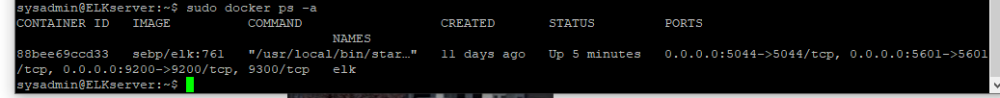

## Automated ELK Stack Deployment

The files in this repository were used to configure the network depicted below.

Several files have been tested and used to generate a live ELK deployment on Azure. They can be used to either recreate the entire deployment pictured above. elkInstall.yml is used to install the core elasticsearch, logstash and kibana package. filebeat-playbook.yml is used to install filebeat on web servers, metricbeat-playbook.yml is used to install metricbeat on web servers. Filebeat and metricbeat will send log and container metric information to ELK for monitoring. Below is from filebeat yaml file: 

  - filebeat-playbook.yml
           
         - name: installing and launching filebeat
           hosts: webservers
           become: yes
           tasks:

           - name: download filebeat deb
             command: curl -L -O https://artifacts.elastic.co/downloads/beats/filebeat/filebeat-7.6.1-amd64.deb

           - name: install filebeat deb
             command: dpkg -i filebeat-7.6.1-amd64.deb

           - name: drop in filebeat.yml
             copy:
               src: /etc/ansible/files/filebeat-config.yml
               dest: /etc/filebeat/filebeat.yml

           - name: enable and configure system module
             command: filebeat modules enable system

           - name: setup filebeat
             command: filebeat setup

           - name: start filebeat service
             command: service filebeat start
 
           - name: enable service filebeat on boot
             systemd:
               name: filebeat
               enabled: yes

This document contains the following details:
- Description of the Topology
- Access Policies
- ELK Configuration
  - Beats in Use
  - Machines Being Monitored
- How to Use the Ansible Build

### Description of the Topology

The main purpose of this network is to expose a load-balanced and monitored instance of DVWA, the D*mn Vulnerable Web Application.

Load balancing ensures that the application will be highly available, in addition to restricting public access to the network.
- Load balancers add resiliency by rerouting live traffic from one server to another if a server falls prey to DDoS attacks or otherwise becomes unavailable. In this way, load balancers help to eliminate single points of failure, reduce the attack surface, hide applicatoin servers behind load balancer, and make it harder to exhaust resources and saturate links. At the same time, load balancer can enhance user experience by improving performance, resilience and scaling of website.

  Jump server creates separation between high risk user workstation and privileged assets within the network. Only jump box is exposed directly to users, and the priviledged servers can only be accesssed from jump box which will be hardened and monitored to improve security.

Integrating an ELK server allows users to easily monitor the vulnerable VMs for changes to the files and system metrics.
- What does Filebeat watch for? filebeat watch for the files indicated in the configuration and send the data to ELK (logstash) for further processing.
- What does Metricbeat record? Metricbeat watch for OS and services and send the data to ELK.

The configuration details of each machine may be found below.
_Note: Use the [Markdown Table Generator](http://www.tablesgenerator.com/markdown_tables) to add/remove values from the table_.

| Name      | Function                                             | IP Address                              | Operating System |
|-----------|------------------------------------------------------|-----------------------------------------|------------------|
| jumpBoxMS | Gateway with ansible container                       | 10.0.0.4(private) 52.170.35.121(public) | Linux            |
| web-1     | Host DVWA Container Contains Filebeat and Metricbeat | 10.0.0.5(private)                       | Linux            |
| web2      | Host DVWA Container Contains Filebeat and Metricbeat | 10.0.0.6(private)                       | Linux            |
| ELKServer | Host ELK container for ELK application               | 10.1.0.4(private) 137.135.60.32(public) | Linux            |

### Access Policies

The machines on the internal network are not exposed to the public Internet. 

Only the jump machine can accept connections from the Internet. Access to this machine is only allowed from the following IP addresses:
- 99.234.202.177/32

Machines within the network can only be accessed by jump machine.
- Which machine did you allow to access your ELK VM? What was its IP address? ELK VM can be accessed through jump machine and its IP is 10.0.0.4(private address). ELK machine private IP is 10.1.0.4 and its public IP is 137.135.60.32.

A summary of the access policies in place can be found in the table below.

| Name     | Publicly Accessible | Allowed IP Addresses |
|----------|---------------------|----------------------|
|jumpBoxMS | Yes                 | 99.234.202.177/32    |
|web-1     | No                  | 10.0.0.4/32          |
|web-2     | No                  | 10.0.0.4/32          |
|ELKServer | No                  | 10.0.0.4/32          |

### Elk Configuration

Ansible was used to automate configuration of the ELK machine. No configuration was performed manually, which is advantageous because...
- What is the main advantage of automating configuration with Ansible? Multiple application instances can share the same configuration to reduce the manual input errors and improve the deployment efficiency.

The playbook implements the following tasks:
- In 3-5 bullets, explain the steps of the ELK installation play. E.g., install Docker; download image; etc._
- install docker.io
- install Python3 PIP
- install Python docker module
- increase virutal memory
- download and install a docker elk container
- enable docker service

The following screenshot displays the result of running `docker ps` after successfully configuring the ELK instance.

### Target Machines & Beats
This ELK server is configured to monitor the following machines:
- 10.0.0.5
- 10.0.0.6

We have installed the following Beats on these machines:
- filebeat
- metricbeat

These Beats allow us to collect the following information from each machine:
- filebeat collect log information (such as linux syslog） and send the data to logstash/elasticsearch for further processing. Finally using Kibana to present the log information.
- metricbeat collect OS and services metric information and send the data to logstash/elasticsearch for further processing. Finally using Kibana to present the log information.

### Using the Playbook
In order to use the playbook, you will need to have an Ansible control node already configured. Assuming you have such a control node provisioned: 

SSH into the control node and follow the steps below:
- Copy the configuration file to /etc/ansible/files folder. (also prepare playbook YAML file under /etc/ansible/roles folder)
- Update the /etc/ansible/hosts file to include target servers (such as web-1 and web-2)
- Run the playbook, and navigate to Kibana page (http://137.135.60.32:5601/app/kibana#/home) to check that the installation worked as expected. (Check if data is sent to ELK)

Answer the following questions to fill in the blanks:_
- _Which file is the playbook? Where do you copy it?_
- _Which file do you update to make Ansible run the playbook on a specific machine? How do I specify which machine to install the ELK server on versus which to install Filebeat on? Update /etc/ansible/roles/filebeat-playbook.yml and /etc/ansible/metricbeat-playbook.yml to prepare filebeat and metricbeat installation. The related configuration file is under /etc/ansbile/files and these files need to be updated to point to the correct ELK. Updating /etc/ansible/hosts file to define the target ELK, filebeat or metricbeat server IP and groups.
 
- _Which URL do you navigate to in order to check that the ELK server is running? http://137.135.60.32:5601/app/kibana#/home

_As a **Bonus**, provide the specific commands the user will need to run to download the playbook, update the files, etc._

In order to use ansible to deploy applications, usually it will need to do the followings:

1. create and edit playbook file using any edit tools such as nano or vi
2. prepare and update specific application related configuration file if requred using edit tools. and ensure the configuratoin file is located at the correct folder. This folder is also used in playbook file.
3. Update hosts file to include the target deployment servers using edit tools such as nano or vi (such as nano /etc/ansible/hosts)
4. Update ansible configuration file to use proper login user (such as nano /etc/ansible/ansible.cfg)
5. Ensure target servers (under the specific server group) is reachable (example command: ansible webservers -m ping, to check all the servers under webservers group). The listed reachable servers in the ping command should be the ones you want to deploy the packages.  
6. Ensure the download packages and version are correct and available. (example command: curl -L -O https://artifacts.elastic.co/downloads/beats/filebeat/filebeat-7.6.1-amd64.deb, also ensure this package name match the name in the next yml install command)
7. use online YAML tool to validate the playbook file format. (example: copy the play book content to https://onlineyamltools.com/validate-yaml to validate the content）
8. After confirm the above steps, run ansible-playbook "playbook yml file" to install the package. (e.g. ansible-playbook metricbeat-playbook.yml under roles folder or provide the correct playbook path and file name)
9. monitor the installation process to ensure there is no errors. or fix the error according to the listed errors.

